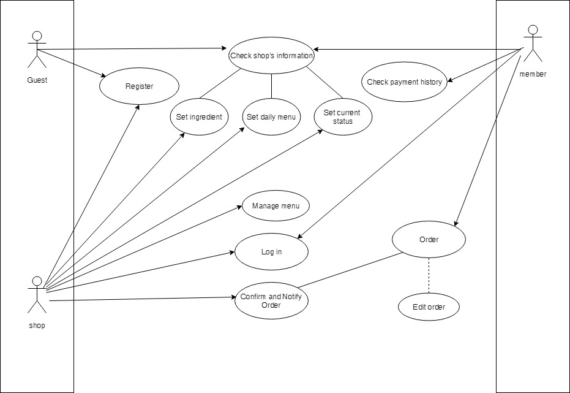

# IT-Canteen

เนื่องจากในปัจจุบัน โรงอาหารคณะเทคโนโลยีสารสนเทศ สถาบันเทคโนโลยีพระจอมเกล้าเจ้าคุณทหารลาดกระบัง มีผู้เข้ามาใช้บริการจำนวนมาก ทำให้เกิดปัญหาด้านต่าง ๆ เช่น
คิวยาวจนบดบังหน้าร้าน, กีดขวางทางเดิน,ไม่ทราบว่าอาหารที่ปรุงเสร็จแล้วเป็นของคิวใด ซึ่งนำไปสู่การหยิบสลับคิวกันได้ จึงต้องการพัฒนาเว็บไซต์ให้มีประสิทธิภาพทั้งในด้านการขาย ด้านการเข้าถึงข้อมูลภายในระบบ และความง่ายในการใช้งาน เพื่อตอบสนองความต้องการของผู้ใช้เว็บ และแก้ปัญหาที่เกิดขึ้น อันเป็นที่มาของการพัฒนาระบบโรงอาหารไอที

## Flow of Events

## Scope

จากการวิเคราะห์และออกแบบเพื่อพัฒนาระบบโรงอาหารคณะไอที ในส่วนของผู้ใช้งาน จะประกอบไปด้วย 3 ส่วน ดังนี้

1.Guest : ผู้ใช้งานที่ยังไม่ได้ลงทะเบียนสามารถเข้าถึงฟังก์ชันต่าง ๆ ดังนี้
* ฟังก์ชันลงทะเบียน (Register)
* ฟังก์ชันตรวจสอบสถานะต่าง ๆ ของร้านค้า (Check shop’s information)

2.User : ผู้ใช้งานฝั่งลูกค้าที่ทำการลงทะเบียนแล้ว และสามารถเข้าถึงฟังก์ชันต่าง ๆ ดังนี้
* ฟังก์ชันเข้าสู่ระบบ (Log in)
* ฟังก์ชันตรวจสอบสถานะต่าง ๆ ของร้านค้า (Check shop’s information)
* ฟังก์ชันตรวจสอบประวัติการสั่งซื้อ (Check payment history)
* ฟังก์ชันสั่งอาหาร/เครื่องดื่ม (Order)
* ฟังก์ชันแก้ไขรายการที่สั่ง (Edit Order)

3.Shop : ผู้ใช้งานฝั่งร้านค้าที่ทำการลงทะเบียนแล้ว สามารถเข้าถึงฟังก์ชันต่าง ๆ ดังนี้
* ฟังก์ชันเข้าสู่ระบบ (Log in)
* ฟังก์ชันตั้งเมนูประจำวัน (Set daily menu)
* ฟังก์ชันตั้งค่าแสดงสถานะของร้าน (Set current status)
* ฟังก์ชันตั้งค่าแสดงสถานะของวัตถุดิบ (Set ingredient)
* ฟังก์ชันจัดการเมนู (Manage menu)
* ฟังก์ชันยืนยันและแจ้งเตือนรายการของลูกค้า (Confirm and
Notify order)

